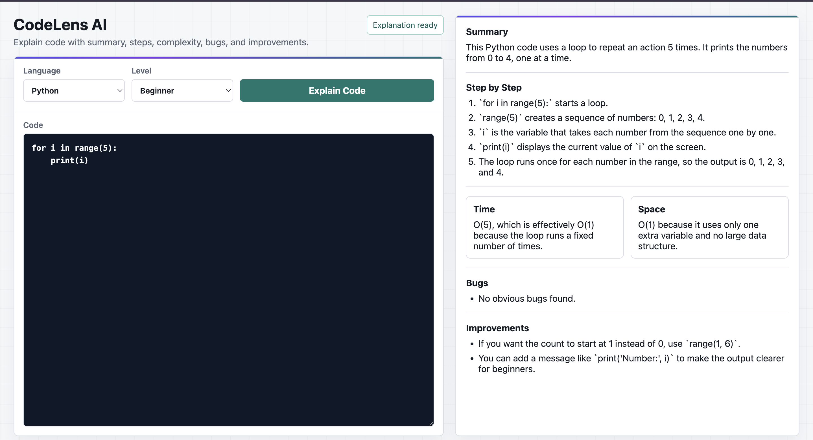

# CodeLens AI

CodeLens AI is an AI-powered code explanation app. It accepts a code snippet, programming language, and explanation level, then returns a structured explanation with a summary, step-by-step breakdown, time and space complexity, possible bugs, and improvement suggestions.




## Features

- Explain code in beginner, intermediate, or advanced language
- Support Python, JavaScript, and C++ inputs
- Return structured JSON using a Pydantic response schema
- Show summary, step-by-step explanation, complexity, bugs, and improvements
- FastAPI backend with LangChain LLM workflow
- Animated frontend built with HTML, CSS, and JavaScript
- Swagger UI available for API testing

## Tech Stack

**Backend**

- Python
- FastAPI
- Pydantic
- LangChain
- LangChain OpenAI
- OpenAI ChatOpenAI
- Uvicorn
- python-dotenv
- CORS middleware

**Frontend**

- HTML
- CSS
- JavaScript
- Fetch API
- Responsive layout
- CSS animations

## Project Structure

```txt
codeLensAI/
├── backend/
│   ├── __init__.py
│   ├── chains.py
│   ├── llm_model.py
│   ├── main.py
│   ├── prompts.py
│   ├── routes.py
│   ├── schema.py
│   └── prompt_template/
│       └── system.txt
├── frontend/
│   ├── app.js
│   ├── index.html
│   └── styles.css
├── requirements.txt
└── README.md
```

## API Endpoints

```txt
GET  /health
POST /explain-code
```

## Example Request

```json
{
  "language": "python",
  "level": "beginner",
  "code": "for i in range(5):\n    print(i)"
}
```

## Example Response

```json
{
  "summary": "This Python code uses a loop to print numbers from 0 to 4.",
  "step_by_step": [
    "`for i in range(5):` starts a loop.",
    "`range(5)` creates the numbers 0, 1, 2, 3, and 4.",
    "`print(i)` displays the current number."
  ],
  "complexity": {
    "time": "O(5), effectively O(1) for this fixed range.",
    "space": "O(1)"
  },
  "bugs": [],
  "improvements": [
    "Add a clearer message in the print statement for beginners."
  ]
}
```

## Setup

### 1. Create and Activate a Virtual Environment

```bash
python3 -m venv .venv
source .venv/bin/activate
```

### 2. Install Dependencies

```bash
pip install -r requirements.txt
```

If `langchain-openai` is not already installed, add it:

```bash
pip install langchain-openai
```

### 3. Create `.env`

Create a `.env` file in the project root:

```env
OPENAI_API_KEY=your_openai_api_key_here
```

### 4. Run the Backend

```bash
uvicorn backend.main:app --reload
```

Backend:

```txt
http://127.0.0.1:8000
```

Swagger docs:

```txt
http://127.0.0.1:8000/docs
```

### 5. Run the Frontend

From the `frontend` directory:

```bash
python3 -m http.server 8001
```

Frontend:

```txt
http://127.0.0.1:8001
```

## How It Works

```txt
Frontend form
    -> POST /explain-code
    -> CodeExplainRequest schema
    -> LangChain prompt
    -> ChatOpenAI model
    -> PydanticOutputParser
    -> CodeExplainResponse
    -> Frontend result panel
```

## Author

Yash Rawat

GitHub: [@thinkofyashh](https://github.com/thinkofyashh)
